Danke, dass Du entschieden hast bei Zeit.shift mitzuhelfen! Diese Anleitung wird Dich durch die Historypin-Aktivitäten führen. Die Aktivitäten betreffen das Taggen von Werbeanzeigen, die vor etwa 100 Jahren in Tiroler Zeitungen veröffentlicht wurden.

**Die Aktivitäten sind für die Arbeit auf Desktop-Computern optimiert.**

Bei Fragen zu den Aktivitäten oder für Kommentare zu dieser Anleitung kontaktiere bitte das Zeit.shift-Team unter: <strong>zeitshift@eurac.edu</strong>.

## 1. In die Sammlung einsteigen

Öffne einen Internetbrowser (wir empfehlen [Chrome](https://www.google.com/chrome/) oder [Safari](https://www.apple.com/safari/)) und navigiere zu: <a href="https://www.historypin.org/de/zeit-shift" target="_blank">https://www.historypin.org/de/zeit-shift</a>

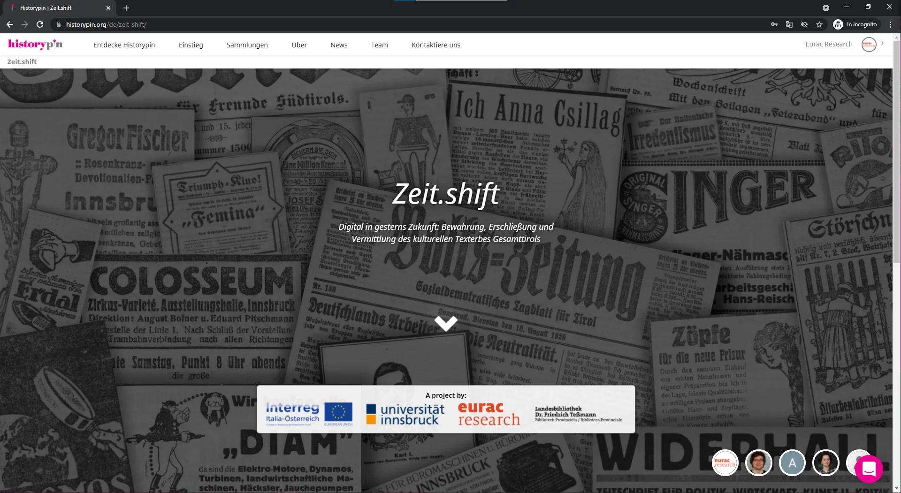

Klicke auf den weißen Pfeil oder scrolle durch die Landingpage, um die Inhalte der Sammlung zu sehen. Diese Galerieansicht listet alle Anzeigen und Unterkollektionen von Zeit.shift. Jede Unterkollektion steht für eine andere Zeitung.

Beachte: In Historypin werden die Einträge einer Sammlung als „Pins“ bezeichnet. Im Fall von Zeit.shift stehen die Pins für Werbeanzeigen. In dieser Anleitung werden wir Einträge der Sammlung sowohl als „Anzeigen“ als auch als „Pins“ bezeichnen.
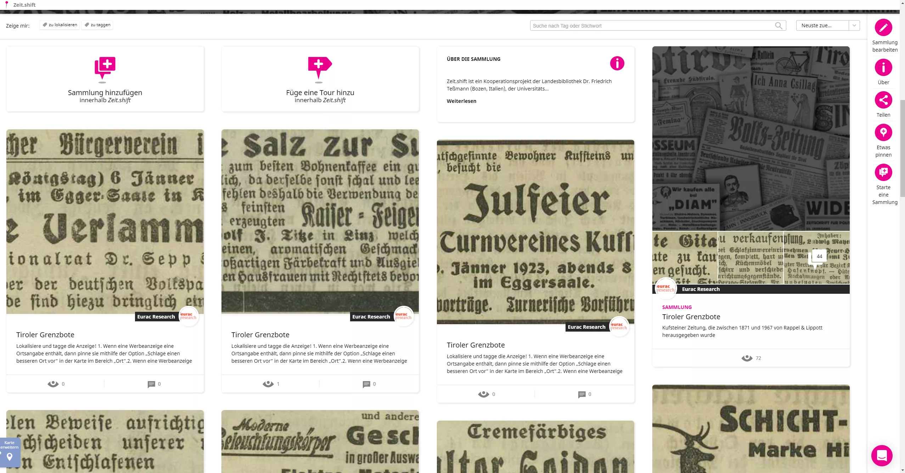

<!--
## 2. Die richtigen Pins in der Sammlung auswählen

Die Suchzeile unter dem Projektbanner erlaubt dir mithilfe von Tags and Schlüsselwörtern nach Inhalten zu suchen oder die Sammlung nach Inhalten mit Kommentaren zu filtern.

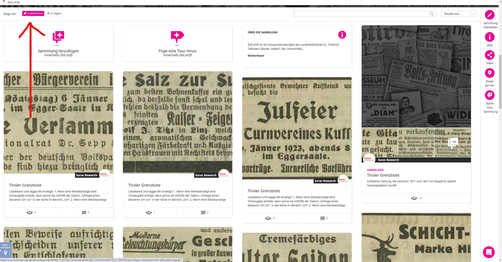

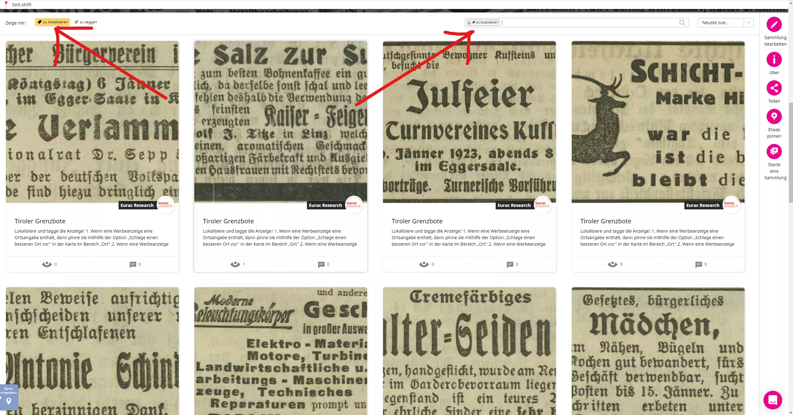

Um die Tags „zu lokalisieren“ und „zu taggen“ aus der Suche zu entfernen, klicke auf das jeweils zugehörige 🗙-Icon in der Suchzeile.

Zusätzlich kannst du das Drop-Down-Menü neben der Suchzeile benutzen, um die Inhalte chronologisch oder alphabetisch zu sortieren.

-->

## 2. Zu der Sammlung beitragen

Um die Aktivität zu starten, klicke auf die Untersammlung oder Zeitung an der du arbeiten möchtest. Die Landingpage der Untersammlung ist genauso aufgebaut wie die Hauptsammlung von Zeit.shift.
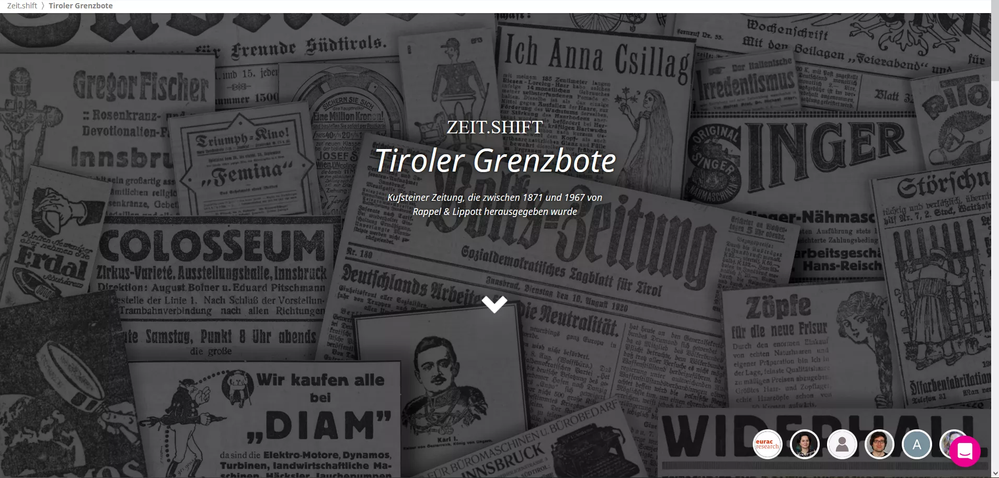

Klicke anschließend auf die „zu lokaliserien“ und „zu taggen“ Tags, um nach Anzeigen zu filtern, die noch bearbeitet werden müssen.

Nachdem du die Anzeigen mithilfe der „zu lokalisieren“ und/oder „zu taggen“ Tags gefiltert hast, klicke auf eine Anzeige deiner Wahl, um daran zu arbeiten.

### 2.1. Schlage einen besseren Ort vor

Um einen besseren Ort für die Anzeige vorzuschlagen, klicke auf den _Schlage einen besseren Ort vor_-Link in der Ortsbox. Ein neues Fenster wird sich öffnen und dich zur Eingabe eines neuen Ortes auffordern. Du kannst grobe oder präzise Ortsangaben machen, indem du das Suchfeld und/oder die Kartenansicht verwendest. Zur Präzisierung kannst du den großen pinken Pin zu dem gewünschten Ort ziehen. Falls du die Karte vergrößern möchtest, klicke auf das weiße Symbol in der oberen rechten Ecke des Fensters. Um die Karte wieder auf ihre ursprüngliche Größe zurückzusetzen, klicke nochmals auf das weiße Symbol. Um deinen Vorschlag zu speichern, füge einen Kommentar ein (z.B. "Ort hinzugefügt"), klicke auf den _Speichern_-Button und schließe das Fenster durch Klicken auf das pinke 🗙 Symbol in der oberen rechten Ecke des Fensters.
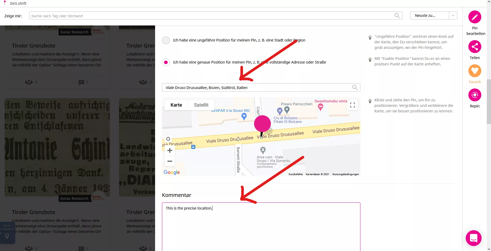

Falls die Anzeige keinerlei Adressangabe enthält, füge mithilfe der _Füge ein Tag hinzu_-Option ein „ohne ort“-Tag hinzu. Die Option befindet sich im rechten Seitenbalken (siehe nächster Abschnitt).

### 2.2. Tags

Der _Tags_-Abschnitt ermöglicht es Dir, eine Anzeige zu klassifizieren. Tags in Zeit.shift sollten in Kleinschreibung eingegeben werden und können auf Englisch, Deutsch oder Italienisch sein. Die Tags sind sehr nützlich, da sie Zeit.shift- und Historypin-Nutzern helfen bestimmte Einträge leichter zu finden. Wir bitten Dich folgende Arten von Tags einzufügen:

- „ohne ort“, falls die Anzeige keine Adressangabe enthält;
- - „unleserlich“, falls die Anzeige nicht gut zu lesen ist (z.B. bei ausgeblichener Tinte oder verschwommenen Bildern);
- - „duplikat“, falls die Anzeige ein Duplikat einer anderen Anzeige ist;
- - „review“, falls Du weitere Probleme bei der Anzeige feststellst, die Du gerne mitteilen möchtest (z.B. die Anzeige ist teilweise abgeschnitten);
- - inhaltliche Tags (mindestens drei), die eine gute Beschreibung der Anzeige liefern, inklusive Personennamen, Objekten, Feierlichkeiten, etc. (e.g. „Adolf Titze“, „Schuhe“, „Weihnachten“).
Um ein inhaltliches Tag hinzuzufügen, tippe den Namen in das _Tagname_-Feld. Während Du tippst, wird sich ein Drop-Down-Menü mit Vorschlägen öffnen, die anzeigen, welche Tag bereits von Historypin-Benutzern eingefügt wurden. Falls Dein Tag bereits in der Liste mit Vorschlägen vorhanden ist, wähle es aus und klicke auf den _Tag hinzufügen_-Button. Falls Dein Tag nicht in der Liste mit Vorschlägen ist, klicke auf den ersten Eintrag in der Liste und klicke anschließend nochmals auf den _Tag hinzufügen_-Button. Neue Tags sollten neben den bestehenden Tags unter der Karte zu sehen sein.

Beachte: Umlaute können von Historypin nicht korrekt angezeigt werden, deshalb achte darauf sie auszuschreiben (z.B. schreibe nicht „mühle“ sondern „muehle“).
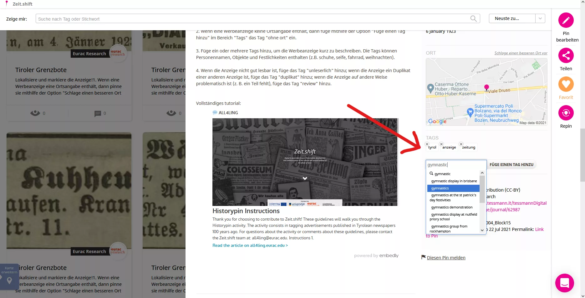

### 2.3. Fakultativ

Im rechten Seitenbalken findest du einen _Teilen_-Button, der es dir ermöglicht eine Anzeige über Social Media zu teilen oder sie in eine Webseite einzubetten.

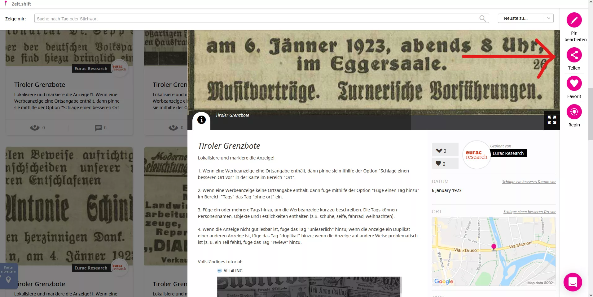

Unter dem _Teilen_-Button findest Du einen _Favorit_-Button ♡. Dieser Button erlaubt es Dir eine Anzeige als Favorit zu markieren. Wenn Du ein Objekt als Favorit kennzeichnest, färbt sich das Herzsymbol ♡ rot; um die Favorit-Markierung rückgängig zu machen, klicke einfach nochmals auf den Herz-Button ♡ und er wird sich wieder pink färben. Du kannst alle deine Favoriten in deinem Historypin-Profil unter dem Abschnitt _Favoriten_ aufrufen.

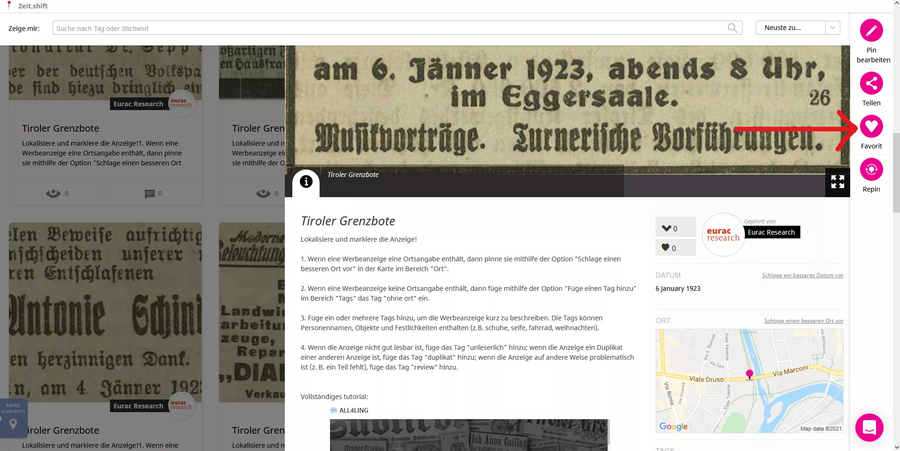

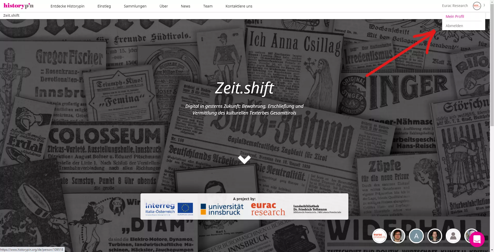

Unter dem _Favorit_-Button findest du einen _Repin_-Button. Dieser Button ermöglicht es dir eine Kopie des Pins für eine andere Historypin-Sammlung zu machen. Wenn du auf _Repin_ klickst, wirst du gefragt, ob du die Kopie des Pins in einer bestehenden Sammlung, auf die du Zugriff hast, speichern willst, oder ob Du ihn in einer neuen, selbsterstellten Sammlung speichern willst.

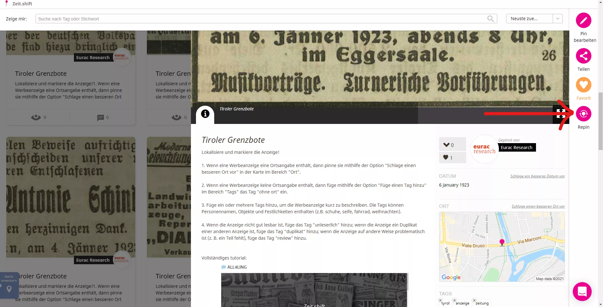

<!--
## 3. Historypin Tutorials

Historypin „How to“-Anleitungen können hier aufgerufen werden: [https://about.historypin.org/how-to-guides/](https://about.historypin.org/how-to-guides/)
-->

## 3. Kontakt

### 3.1. Eurac Research
Um das Team von Eurac Research zu erreichen, bitte schreibe an: <strong>zeitshift@eurac.edu</strong>

### 3.2. Historypin
Um das Team von Historypin zu erreichen, klicke auf das Chat-Icon in der unteren rechten Ecke des Bildschirms.

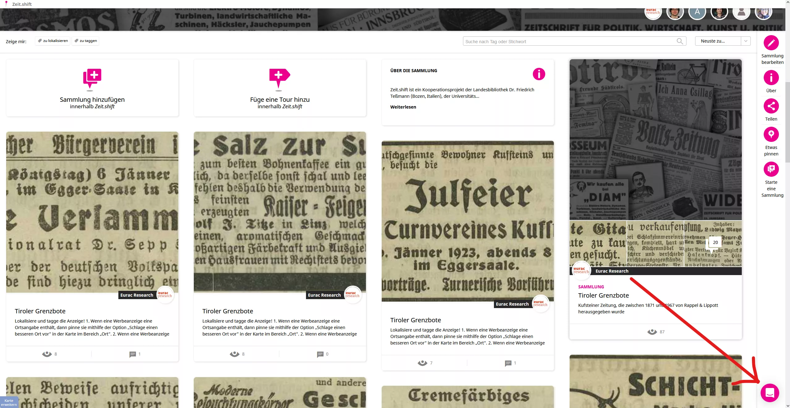

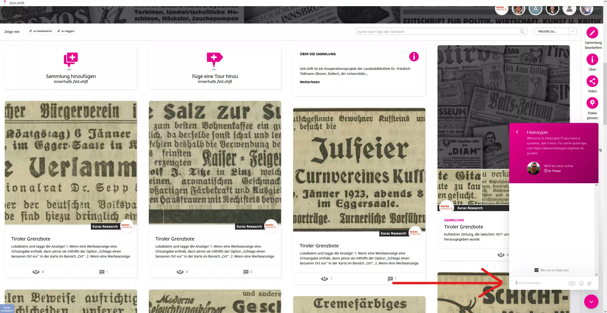

## 4. FAQ (Häufige Fragen)

**Warum verändert sich manchmal die Anzahl der Pins auf der Karte?** 
Dies ist ein bekannter Bug von Historypin. Indem du die Seite neu lädst, kannst du die korrekte Anzahl an Pins wiederherstellen.

**Meine Tags und Kommentare werden nicht gespeichert. Was ist hier los?** 
Lade deine Browserseite neu und/oder entleere deinen Browsercache um deine Änderungen zu sehen.

**Umlaute in tags** 
Tags in Historypin dürfen kein Umlaute enthalten. Gib daher bitte die entsprechende Umschreibung für Umlaute ein, z. B. _mühle --> muehle_.

  

<a href="https://www.historypin.org/de/zeit-shift/geo/46.494565,11.347343,17/bounds/46.490037,11.345184,46.499092,11.349502/paging/1" target="_blank" title="Opens in new tab"><button type="button" class="btn btn-success">🚀 AKTIVITÄT STARTEN!</button></a>

